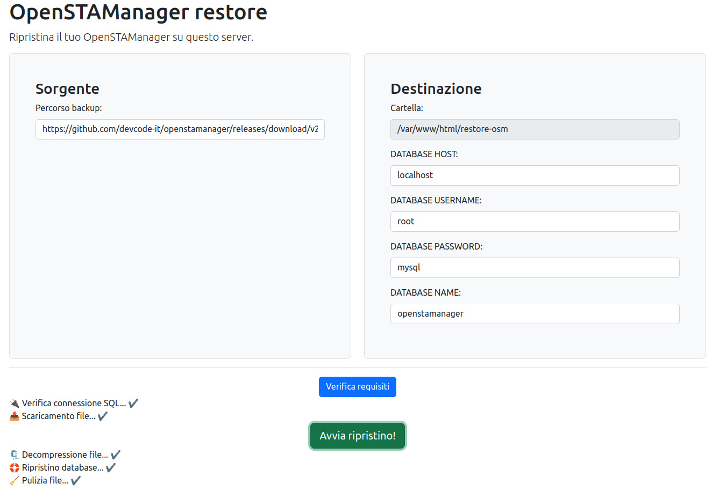

# Restore OSM
Script per il download di un backup di OpenSTAManager e il ripristino su un nuovo server.

Permette di inserire l'indirizzo del backup di OpenSTAManager e di specificare i dati del database locale per importare il database.

Schermata di esempio:

